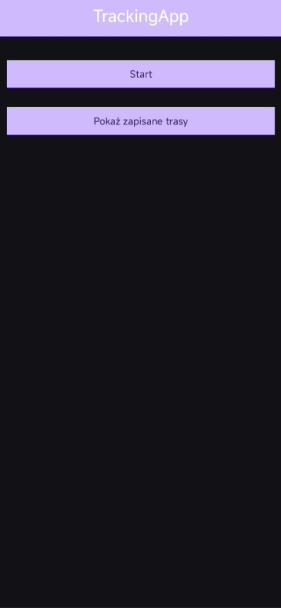
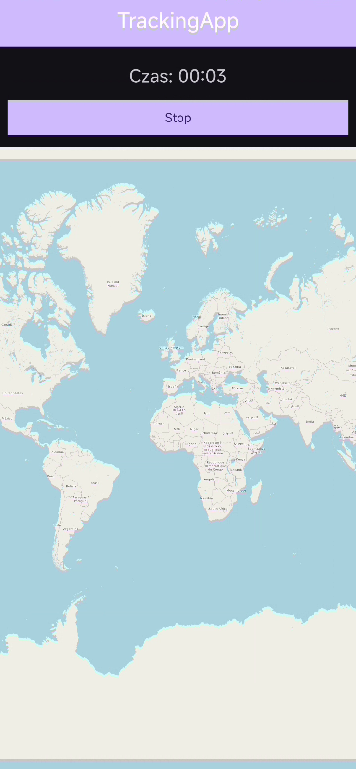

# 🚶‍♂️ TrackingApp

**TrackingApp** to aplikacja mobilna na Androida służąca do śledzenia tras użytkownika oraz ich wizualizacji na mapie. Trasy zapisywane są w bazie danych **InfluxDB**, a do wyświetlania mapy wykorzystano bibliotekę **osmdroid** (OpenStreetMap).

---

## 📱 Funkcje

- ✅ Rejestrowanie lokalizacji użytkownika i zapisywanie jej jako trasa (`location`) w InfluxDB.
- ✅ Lista zapisanych tras z możliwością:
  - podglądu trasy na mapie,
  - usunięcia trasy z bazy danych.
- ✅ Wyświetlanie przebiegu trasy na mapie z:
  - rysowaną linią (`Polyline`),
  - znacznikami punktu początkowego i końcowego.
- ✅ Obsługa gestów na mapie (zoom, przesuwanie).

---

## 🗺️ Użyte biblioteki

- [osmdroid](https://github.com/osmdroid/osmdroid) – do obsługi mapy (OpenStreetMap).
- [InfluxDB Java Client](https://github.com/influxdata/influxdb-client-java) – do komunikacji z bazą InfluxDB.
- AndroidX, Material Components.

---

## ⚙️ Wymagania

- Android 8.0 (API 26) lub wyższy.
- Dostęp do Internetu.
- Serwer InfluxDB (v2.x) skonfigurowany z buckietem `TrackingApp`.

---

## 📷 Zrzuty ekranu

